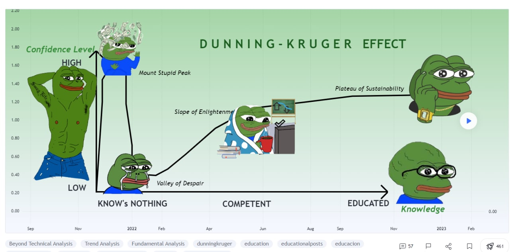

## QuickStart:

This is a python project that will help me make buttloads of money thank you.

main.py: Runs and pulls data from vantage. Also works with the tiger brokers api and is synced to my tiger brokers
account using the private key. If you want to do the same, you will need a tiger brokers account and
get your own private key for it

extract_tickers.py: Extracts tickers from the finviz and saves them to a file

### Idea:

Step 1: Extract the appropriate tickers from finviz. This way they handle the charting instead of me.

Step 2: Run some machine learning or according to the 
statisitcs provided from [success_rates](https://the5ers.com/price-pattern-study/)

Step 3: Profit (Or lose terribly)

# Remember!!!

